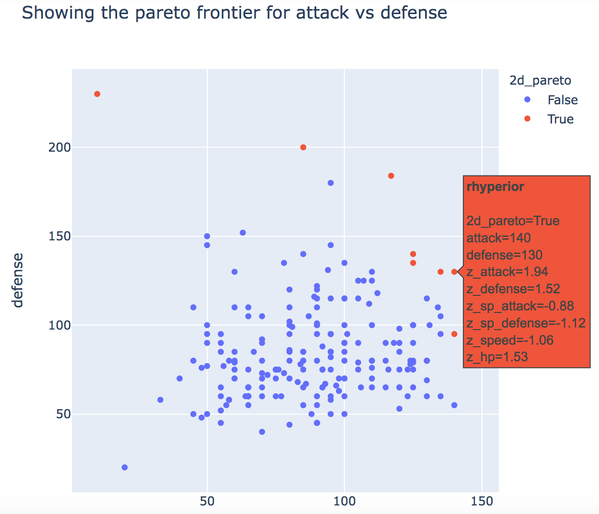
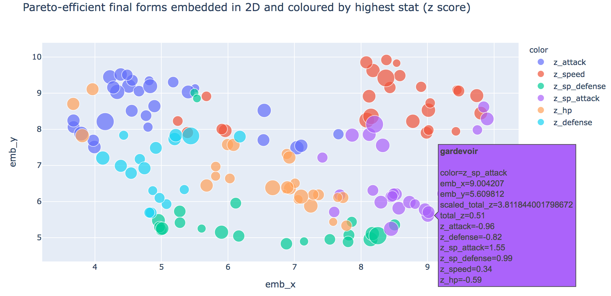

# PokeParetoSS
Pareto efficiency analysis of Pokemon Sword/Shield final forms

All centered around [this notebook](https://github.com/drsaunders/PokeParetoSS/blob/main/PokeParetoSS.ipynb), but is meant to be seen with interactive datatables and hover-over plotly plots, so strongly suggest checking it out in a live notebook.

Techniques used:
* Pareto efficiency 
* Interactive data tables (with itables)
* Interactive plots (with Plotly)
* UMAP embeddings
* Z scores
* Recursion (to descend evolutionary trees)
